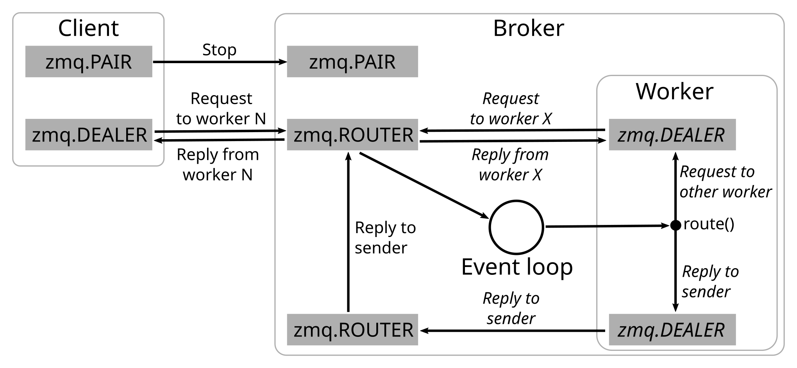

# ZeroMQ with asyncio examples

Example Python classes distributing work using ZeroMQ and asyncio

## Versions

- Python: 3.10.4
- ZeroMQ: 4.3.4
- pyzmq:  23.2.0

## First example

In the first example (*zmq_asyncio_example_1.py*), a main routine acts as a client that starts up
a *broker* object in a separate thread. The broker binds to several ØMQ sockets for communication
with *workers* and main requests. It also starts a number of *worker* objects. Broker and workers
run in separate threads with their own asyncio event loops on which they poll and process messages.

Broker and worker nodes terminate when a stop signal is sent via ØMQ pair sockets from the main
routine to the broker or from broker to workers.

Both main routine and workers can send requests to a ØMQ router socket bound by the broker. The
broker forwards messages to designated workers via worker-specific ØMQ push sockets. Workers reply
to messages received from the broker on their ØMQ pull socket through a ØMQ dealer that connects to
a router socket of the broker dedicated to receive worker replies from where they are forwarded to
the original request sender via the other ØMQ router socket.

## Second example

In the second example (*zmq_asyncio_example_2.py*), a main routine acts as a client that starts up
a *broker* object in a separate thread. The broker binds to several ØMQ sockets for communication
with *workers* and main requests. It also starts a number of *worker* objects as well as a number of
asyncio event loops. On one of the event loops the broker polls ØMQ sockets and processes messages.
The other event loops are assigned to separate threads and execute requests directed at workers.

The broker terminates when the main routine sends a stop signal on the ØMQ pair socket.

Both main routine and workers can send requests to a ØMQ router socket bound by the broker. Workers
communicate with broker sockets through ØMQ dealer sockets that are temporarily created to handle
the momentary messaging. They send replies to a dedicated router socket of the broker from where
they are forwarded to the original request sender via the first router socket.

